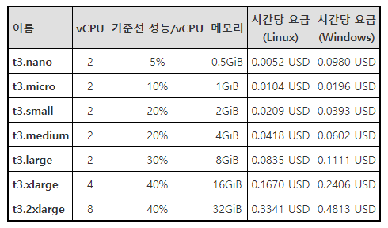

# 15. 리소스 관리

## 15.1 리소스 배포
### 1) 초기화
최초의 작업을 하면 프로방이더 모듈 설치함

### 3) 변경 사항 계획
`terraform plan`
dry run 이다 ansible의 --check와 같은 역할

### 5) 상태 확인
`terraform.tfstate` 파일 매우 매우 매우 중요함


* 먼저 실습을 해보자아~ ^^?! 193 ~ 202
써!
```tf
terraform {
  required_providers {
    aws = {
      source = "hashicorp/aws"
      version = "~> 3.34"
    }
  }
}

provider "aws" {
  profile = "default"
  region = "ap-northeast-2"
}

resource "aws_instance" "my_instance" {
  ami = "ami-013b765873d42324a" # Ubuntu 18.04 amd64 ami
  instance_type = "t3.micro"

  tags = {
    Name = "MyInstance"
  }
}
```
정의할 메타속성(테라폼에서 관리)이 필요하다면 먼저 선언한다. resource 부분 상단에 작성.

테라폼 파일 자동 정렬
```shell
terraform fmt
```

* 프로바이더 플러그인 설치
```shell
terraform init # 이거 하고나면 해당 경로에 file 생겨남

azwell@azwell-KVM:~/terraform_prac$ file .terraform/providers/registry.terraform.io/hashicorp/aws/3.61.0/linux_amd64/terraform-provider-aws_v3.61.0_x5 
.terraform/providers/registry.terraform.io/hashicorp/aws/3.61.0/linux_amd64/terraform-provider-aws_v3.61.0_x5: ELF 64-bit LSB executable, x86-64, version 1 (SYSV), statically linked, Go BuildID=m7TB9_vbkn6LKW2gtylx/A0DMvtaaRSewe8HULVvb/p05pEP56Ho6SF2FBNWdE/HxiWMsIxG0ome_rvdbVI, stripped
```


잘 썻다고 함
```shell
$ terraform validate
Success! The configuration is valid.
```

생퀴 어떻게 할지 함 보자
```shell
$ terraform plan

Terraform used the selected providers to generate the following execution plan. Resource actions are indicated with the
following symbols:
  + create

Terraform will perform the following actions:

  # aws_instance.my_instance will be created
  + resource "aws_instance" "my_instance" {
      + ami                                  = "ami-013b765873d42324a"
      + arn                                  = (known after apply)
      + associate_public_ip_address          = (known after apply)
      + availability_zone                    = (known after apply)
      + cpu_core_count                       = (known after apply)
      + cpu_threads_per_core                 = (known after apply)
      + disable_api_termination              = (known after apply)
      + ebs_optimized                        = (known after apply)
      + get_password_data                    = false
      + host_id                              = (known after apply)
      + id                                   = (known after apply)
      + instance_initiated_shutdown_behavior = (known after apply)
      + instance_state                       = (known after apply)
      + instance_type                        = "t3.micro"
      + ipv6_address_count                   = (known after apply)
      + ipv6_addresses                       = (known after apply)
      + key_name                             = (known after apply)
      + monitoring                           = (known after apply)
      + outpost_arn                          = (known after apply)
      + password_data                        = (known after apply)
      + placement_group                      = (known after apply)
      + primary_network_interface_id         = (known after apply)
      + private_dns                          = (known after apply)
      + private_ip                           = (known after apply)
      + public_dns                           = (known after apply)
      + public_ip                            = (known after apply)
      + secondary_private_ips                = (known after apply)
      + security_groups                      = (known after apply)
      + source_dest_check                    = true
      + subnet_id                            = (known after apply)
      + tags                                 = {
          + "Name" = "MyInstance"
        }
      + tags_all                             = {
          + "Name" = "MyInstance"
        }
      + tenancy                              = (known after apply)
      + user_data                            = (known after apply)
      + user_data_base64                     = (known after apply)
      + vpc_security_group_ids               = (known after apply)

      + capacity_reservation_specification {
          + capacity_reservation_preference = (known after apply)

          + capacity_reservation_target {
              + capacity_reservation_id = (known after apply)
            }
        }

      + ebs_block_device {
          + delete_on_termination = (known after apply)
          + device_name           = (known after apply)
          + encrypted             = (known after apply)
          + iops                  = (known after apply)
          + kms_key_id            = (known after apply)
          + snapshot_id           = (known after apply)
          + tags                  = (known after apply)
          + throughput            = (known after apply)
          + volume_id             = (known after apply)
          + volume_size           = (known after apply)
          + volume_type           = (known after apply)
        }

      + enclave_options {
          + enabled = (known after apply)
        }

      + ephemeral_block_device {
          + device_name  = (known after apply)
          + no_device    = (known after apply)
          + virtual_name = (known after apply)
        }

      + metadata_options {
          + http_endpoint               = (known after apply)
          + http_put_response_hop_limit = (known after apply)
          + http_tokens                 = (known after apply)
        }

      + network_interface {
          + delete_on_termination = (known after apply)
          + device_index          = (known after apply)
          + network_interface_id  = (known after apply)
        }

      + root_block_device {
          + delete_on_termination = (known after apply)
          + device_name           = (known after apply)
          + encrypted             = (known after apply)
          + iops                  = (known after apply)
          + kms_key_id            = (known after apply)
          + tags                  = (known after apply)
          + throughput            = (known after apply)
          + volume_id             = (known after apply)
          + volume_size           = (known after apply)
          + volume_type           = (known after apply)
        }
    }

Plan: 1 to add, 0 to change, 0 to destroy.

─────────────────────────────────────────────────────────────────────────────────────────────────────────────────────────────

Note: You didn't use the -out option to save this plan, so Terraform can't guarantee to take exactly these actions if you run
"terraform apply" now.
```

apply 때려보자
위에 plan 칠때 내용 똑같이 나오고 진짜 할꺼냐고 물어본다.
yes 떄때료 때려버렷!
```shell
$ terraform plan
...plan 내용
Do you want to perform these actions?
  Terraform will perform the actions described above.
  Only 'yes' will be accepted to approve.

  Enter a value: yes

aws_instance.my_instance: Creating...
aws_instance.my_instance: Still creating... [10s elapsed]
aws_instance.my_instance: Creation complete after 13s [id=i-01072fc03c31b7870]

Apply complete! Resources: 1 added, 0 changed, 0 destroyed.
```

인스턴스 종류


잘 추가 되었음!


현재 상태 검사
```shell
$ terraform show
# aws_instance.my_instance:
resource "aws_instance" "my_instance" {
    ami                                  = "ami-013b765873d42324a"
    arn                                  = "arn:aws:ec2:ap-northeast-2:766915375560:instance/i-01072fc03c31b7870"
    associate_public_ip_address          = true
    availability_zone                    = "ap-northeast-2d"
    cpu_core_count                       = 1
    cpu_threads_per_core                 = 2
    disable_api_termination              = false
    ebs_optimized                        = false
    get_password_data                    = false
    hibernation                          = false
    id                                   = "i-01072fc03c31b7870"
    instance_initiated_shutdown_behavior = "stop"
    instance_state                       = "running"
    instance_type                        = "t3.micro"
    ipv6_address_count                   = 0
    ipv6_addresses                       = []
    monitoring                           = false
    primary_network_interface_id         = "eni-0f1829a53074eb85c"
    private_dns                          = "ip-172-31-52-6.ap-northeast-2.compute.internal"
    private_ip                           = "172.31.52.6"
    public_dns                           = "ec2-3-38-28-58.ap-northeast-2.compute.amazonaws.com"
    public_ip                            = "3.38.28.58"
    secondary_private_ips                = []
    security_groups                      = [
        "default",
    ]
    source_dest_check                    = true
    subnet_id                            = "subnet-0328abd3c1fcaca2a"
    tags                                 = {
        "Name" = "MyInstance"
    }
    tags_all                             = {
        "Name" = "MyInstance"
    }
    tenancy                              = "default"
    vpc_security_group_ids               = [
        "sg-0dd3742b1a21e3740",
    ]

    capacity_reservation_specification {
        capacity_reservation_preference = "open"
    }

    credit_specification {
        cpu_credits = "unlimited"
    }

    enclave_options {
        enabled = false
    }

    metadata_options {
        http_endpoint               = "enabled"
        http_put_response_hop_limit = 1
        http_tokens                 = "optional"
    }

    root_block_device {
        delete_on_termination = true
        device_name           = "/dev/sda1"
        encrypted             = false
        iops                  = 100
        tags                  = {}
        throughput            = 0
        volume_id             = "vol-0bbbf7ca0bedf9a34"
        volume_size           = 8
        volume_type           = "gp2"
    }
}
```

항상 apply 하고 나면 terraform.tfstate 파일이 생김.
중요한 파일임.

이전의 상태는 terraform.tfstate.backup 파일에 저장된다.

## 15.2 리소스 변경
ami 를 ami-0a0ac042031ba59d1 (Ubuntu 20.04 focal) 로 변경 하고 확인해보자
이미지를 교체할 수는 없기 떄문에
삭제하고 다시 생성한다.

```shell
$ terraform plan
aws_instance.my_instance: Refreshing state... [id=i-01072fc03c31b7870]

Terraform used the selected providers to generate the following execution plan. Resource actions are indicated with the
following symbols:
-/+ destroy and then create replacement

Terraform will perform the following actions:

  # aws_instance.my_instance must be replaced
-/+ resource "aws_instance" "my_instance" {
      ~ ami                                  = "ami-013b765873d42324a" -> "ami-0a0ac042031ba59d1" # forces replacement
      ~ arn                                  = "arn:aws:ec2:ap-northeast-2:766915375560:instance/i-01072fc03c31b7870" -> (known after apply)
      ~ associate_public_ip_address          = true -> (known after apply)
      ~ availability_zone                    = "ap-northeast-2d" -> (known after apply)
      ~ cpu_core_count                       = 1 -> (known after apply)
      ~ cpu_threads_per_core                 = 2 -> (known after apply)
      ~ disable_api_termination              = false -> (known after apply)
      ~ ebs_optimized                        = false -> (known after apply)
      - hibernation                          = false -> null
      + host_id                              = (known after apply)
      ~ id                                   = "i-01072fc03c31b7870" -> (known after apply)
      ~ instance_initiated_shutdown_behavior = "stop" -> (known after apply)
      ~ instance_state                       = "running" -> (known after apply)
      ~ ipv6_address_count                   = 0 -> (known after apply)
      ~ ipv6_addresses                       = [] -> (known after apply)
      + key_name                             = (known after apply)
      ~ monitoring                           = false -> (known after apply)
      + outpost_arn                          = (known after apply)
      + password_data                        = (known after apply)
      + placement_group                      = (known after apply)
      ~ primary_network_interface_id         = "eni-0f1829a53074eb85c" -> (known after apply)
      ~ private_dns                          = "ip-172-31-52-6.ap-northeast-2.compute.internal" -> (known after apply)
      ~ private_ip                           = "172.31.52.6" -> (known after apply)
      ~ public_dns                           = "ec2-3-38-28-58.ap-northeast-2.compute.amazonaws.com" -> (known after apply)
      ~ public_ip                            = "3.38.28.58" -> (known after apply)
      ~ secondary_private_ips                = [] -> (known after apply)
      ~ security_groups                      = [
          - "default",
        ] -> (known after apply)
      ~ subnet_id                            = "subnet-0328abd3c1fcaca2a" -> (known after apply)
        tags                                 = {
            "Name" = "MyInstance"
        }
      ~ tenancy                              = "default" -> (known after apply)
      + user_data                            = (known after apply)
      + user_data_base64                     = (known after apply)
      ~ vpc_security_group_ids               = [
          - "sg-0dd3742b1a21e3740",
        ] -> (known after apply)
        # (4 unchanged attributes hidden)

      ~ capacity_reservation_specification {
          ~ capacity_reservation_preference = "open" -> (known after apply)

          + capacity_reservation_target {
              + capacity_reservation_id = (known after apply)
            }
        }

      - credit_specification {
          - cpu_credits = "unlimited" -> null
        }

      + ebs_block_device {
          + delete_on_termination = (known after apply)
          + device_name           = (known after apply)
          + encrypted             = (known after apply)
          + iops                  = (known after apply)
          + kms_key_id            = (known after apply)
          + snapshot_id           = (known after apply)
          + tags                  = (known after apply)
          + throughput            = (known after apply)
          + volume_id             = (known after apply)
          + volume_size           = (known after apply)
          + volume_type           = (known after apply)
        }

      ~ enclave_options {
          ~ enabled = false -> (known after apply)
        }

      + ephemeral_block_device {
          + device_name  = (known after apply)
          + no_device    = (known after apply)
          + virtual_name = (known after apply)
        }

      ~ metadata_options {
          ~ http_endpoint               = "enabled" -> (known after apply)
          ~ http_put_response_hop_limit = 1 -> (known after apply)
          ~ http_tokens                 = "optional" -> (known after apply)
        }

      + network_interface {
          + delete_on_termination = (known after apply)
          + device_index          = (known after apply)
          + network_interface_id  = (known after apply)
        }

      ~ root_block_device {
          ~ delete_on_termination = true -> (known after apply)
          ~ device_name           = "/dev/sda1" -> (known after apply)
          ~ encrypted             = false -> (known after apply)
          ~ iops                  = 100 -> (known after apply)
          + kms_key_id            = (known after apply)
          ~ tags                  = {} -> (known after apply)
          ~ throughput            = 0 -> (known after apply)
          ~ volume_id             = "vol-0bbbf7ca0bedf9a34" -> (known after apply)
          ~ volume_size           = 8 -> (known after apply)
          ~ volume_type           = "gp2" -> (known after apply)
        }
    }

Plan: 1 to add, 0 to change, 1 to destroy.

─────────────────────────────────────────────────────────────────────────────────────────────────────────────────────────────

Note: You didn't use the -out option to save this plan, so Terraform can't guarantee to take exactly these actions if you run
"terraform apply" now.
```

```shell
...plan 내용
aws_instance.my_instance: Destroying... [id=i-01072fc03c31b7870]
aws_instance.my_instance: Still destroying... [id=i-01072fc03c31b7870, 10s elapsed]
aws_instance.my_instance: Still destroying... [id=i-01072fc03c31b7870, 20s elapsed]
aws_instance.my_instance: Still destroying... [id=i-01072fc03c31b7870, 30s elapsed]
aws_instance.my_instance: Still destroying... [id=i-01072fc03c31b7870, 40s elapsed]
aws_instance.my_instance: Still destroying... [id=i-01072fc03c31b7870, 50s elapsed]
aws_instance.my_instance: Destruction complete after 50s
aws_instance.my_instance: Creating...
aws_instance.my_instance: Still creating... [10s elapsed]
aws_instance.my_instance: Creation complete after 13s [id=i-0ac6810094d1ff76e]

Apply complete! Resources: 1 added, 0 changed, 1 destroyed.
```

## 15.3 리소스 삭제

```shell
$ terraform destroy 
aws_instance.my_instance: Refreshing state... [id=i-0ac6810094d1ff76e]

Terraform used the selected providers to generate the following execution plan. Resource actions are indicated with the
following symbols:
  - destroy

Terraform will perform the following actions:

  # aws_instance.my_instance will be destroyed
  - resource "aws_instance" "my_instance" {
      - ami                                  = "ami-0a0ac042031ba59d1" -> null
      - arn                                  = "arn:aws:ec2:ap-northeast-2:766915375560:instance/i-0ac6810094d1ff76e" -> null
      - associate_public_ip_address          = true -> null
      - availability_zone                    = "ap-northeast-2d" -> null
      - cpu_core_count                       = 1 -> null
      - cpu_threads_per_core                 = 2 -> null
      - disable_api_termination              = false -> null
      - ebs_optimized                        = false -> null
      - get_password_data                    = false -> null
      - hibernation                          = false -> null
      - id                                   = "i-0ac6810094d1ff76e" -> null
      - instance_initiated_shutdown_behavior = "stop" -> null
      - instance_state                       = "running" -> null
      - instance_type                        = "t3.micro" -> null
      - ipv6_address_count                   = 0 -> null
      - ipv6_addresses                       = [] -> null
      - monitoring                           = false -> null
      - primary_network_interface_id         = "eni-098fa8ccd2752a7ad" -> null
      - private_dns                          = "ip-172-31-48-164.ap-northeast-2.compute.internal" -> null
      - private_ip                           = "172.31.48.164" -> null
      - public_dns                           = "ec2-3-38-112-209.ap-northeast-2.compute.amazonaws.com" -> null
      - public_ip                            = "3.38.112.209" -> null
      - secondary_private_ips                = [] -> null
      - security_groups                      = [
          - "default",
        ] -> null
      - source_dest_check                    = true -> null
      - subnet_id                            = "subnet-0328abd3c1fcaca2a" -> null
      - tags                                 = {
          - "Name" = "MyInstance"
        } -> null
      - tags_all                             = {
          - "Name" = "MyInstance"
        } -> null
      - tenancy                              = "default" -> null
      - vpc_security_group_ids               = [
          - "sg-0dd3742b1a21e3740",
        ] -> null

      - capacity_reservation_specification {
          - capacity_reservation_preference = "open" -> null
        }

      - credit_specification {
          - cpu_credits = "unlimited" -> null
        }

      - enclave_options {
          - enabled = false -> null
        }

      - metadata_options {
          - http_endpoint               = "enabled" -> null
          - http_put_response_hop_limit = 1 -> null
          - http_tokens                 = "optional" -> null
        }

      - root_block_device {
          - delete_on_termination = true -> null
          - device_name           = "/dev/sda1" -> null
          - encrypted             = false -> null
          - iops                  = 100 -> null
          - tags                  = {} -> null
          - throughput            = 0 -> null
          - volume_id             = "vol-02e51bd29bcd752bd" -> null
          - volume_size           = 8 -> null
          - volume_type           = "gp2" -> null
        }
    }

Plan: 0 to add, 0 to change, 1 to destroy.

Do you really want to destroy all resources?
  Terraform will destroy all your managed infrastructure, as shown above.
  There is no undo. Only 'yes' will be accepted to confirm.

  Enter a value: yes

aws_instance.my_instance: Destroying... [id=i-0ac6810094d1ff76e]
aws_instance.my_instance: Still destroying... [id=i-0ac6810094d1ff76e, 10s elapsed]
aws_instance.my_instance: Destruction complete after 19s

Destroy complete! Resources: 1 destroyed.
```

## 15.4 리소스 종속성

### 3) 암시적 종속성
  테라폼이 리소스 간의 의존성을 분석해서 알아서 리소스를 생성, 변경, 삭제등의 순서를 결정함.
  의존되는 대상의 인스턴스를 먼저 만든다.

### 4) 명시적 종속성
depends_on : 메타속성. 사용자가 리소스 간에 의존성을 명확하게 정의

### 5) 비 종속성
다른 리소스와 의존성을 가지고 있지 않은 리소스는 동시에 생성됨.


* 실습 따라하기
- provider.tf
```tf
terraform {
  required_providers {
    aws = {
      source  = "hashicorp/aws"
      version = "~> 3.34"
    }
  }
}

provider "aws" {
  profile = "default"
  region  = "ap-northeast-2"
}
```

- main.tf
```tf
resource "aws_instance" "my_instance_a" {
  ami           = "ami-013b765873d42324a" # Ubuntu 18.04 amd64 ami
  instance_type = "t3.micro"

  tags = {
    Name = "MyInstanceA"
  }
}


resource "aws_instance" "my_instance_b" {
  ami           = "ami-013b765873d42324a" # Ubuntu 18.04 amd64 ami
  instance_type = "t3.micro"

  tags = {
    Name = "MyInstanceB"
  }

  depends_on = [aws_s3_bucket.my_bucket]
}


resource "aws_eip" "my_eip" {
  vpc      = true
  instance = aws_instance.my_instance_a.id

  tags = {
    Name = "MyInstanceA"
  }
}

resource "aws_s3_bucket" "my_bucket" {
  acl = "private"
}
```

20.04 하고싶으면
"ami-0a0ac042031ba59d1" # Ubuntu 20.04 focal

* 왜 깃헙에 tfstate 파일 올려서 관리하면 안되냐?!!!
  외부아이피 내부아이피 저장소 그런거 정보 있어서 그런거 아닐깜?
* 오료오..
* 아항 서로 달라서!
* 내가 작업한 상태가 있어야 하는데 딴놈이 작업한 상태가 내쪽으로 와서 꼬인다는거 같음
오홍.. 오케이(일단..)