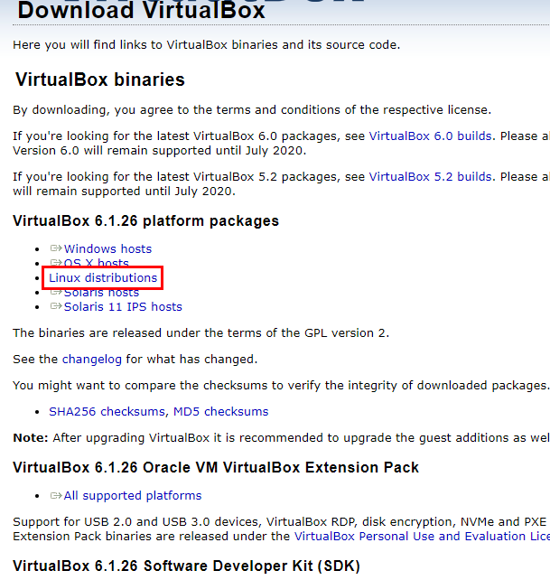

# 2. Ansible 개요

### [실습](./exercise.html)

## 2.1 Ansible 이란?
- 네트워크 장비를 다루는게 주된 기능이여
- OpenSSH 를 사용하여 에이전트 없이 호스트를 관리함
- ansible이 설치되는 엔진은 반드시 유닉스 기반이어야함
- ssh 기본 인증 사용 passwd or key
- 필요한 경우 외부 인증 서버 연동 가능(kerberos, LDAP, MS active Directory 등)

## 2.2 용어
### 1) 제어노드
salt, puppet, chef의 서버와는 결이 다르다.<br/>
salt, puppet, chef는 별도의 데이터 베이스에<br/>
모든 작업을 저장하기 때문에 서버가 죽으면 문제가 발생하는데<br/>
Ansible은 분산형 아키텍쳐이고 노드에 별도의 데이터를 저장하지 않으므로 <br/>
제어노드의 사망과 상관없이 Ansible 만 설치 되어 있으면 다 할수 있음<br/>
Ansible에서는 윈도우 호스트를 지원할 생각 없다고 예전에 얘기했음.<br/>
심경의 변화가 있지 않는 한.. 지원 안할 듯..<br/>
그래도 윈도우가 제어노드가 될 순 없지만 관리 대상은 될 수 있음<br/>

### 2) 관리 노드
모든 대상이 될 수 있음. Windows 도 될 수 있음.<br/>
WinRM (Windows Remote Management) 라는 애를 깔아서 관리가능.


### 3) 인벤토리
관리 노드는 반드시 인벤토리에 있어야만 관리할 수 있으며 단순한 텍스트 파일이다.<br/>
`/etc/ansible/hosts` 에서 관리

### 4) 플러그인
- 매우 다양 하다 그중에 많이 쓰이는 것들<br/>
Become : 권한 상승<br/>
Connection : 연결 관리<br/>
Netconf : 네트워크 장비 다룸<br/>
Vars : 변수들 관리<br/>
등등...<br/>

### 5) 모듈
플레이북에다가 모듈의 동작플레이북은 하나이상의 플레이를 가지고 있어야 함

Python 코드 단위임.<br/>
약 3000개의 엄청 많은 모듈들이 존재함

### 6) 작업
모듈의 순서<br/>
작업은 하나의 모듈을 가지고 있다. (작업과 모듈은 1:1)

### 7) Ad-hoc 명령
하나의 모듈만 실행 가능 간단하게 테스트 용도로 사용

### 8) 플레이
플레이는 하나이상의 작업을 가지고 있다.<br/>
YAML 파일로 작성

### 9) 플레이북
결국 이녀석이 최종 보스<br/>
플레이북은 하나이상의 플레이를 가지고 있어야 함<br/>
ansible-playbook 명령으로 실행<br/>

## 2.3 아키텍쳐


### Ansible Automation Engine === Ansible Engine === Ansible
* 인벤토리 (/etc/ansible/hosts 파일 또는 CMDB에서 받아 옴)<br/>
인벤토리는 관리 대상이 되는 호스트나 네트워크 장비(시스템의 목록)을 가지고 있는 것<br/>
1. static 인벤토리<br/>
   직접 작성 `/etc/hosts` 파일 처럼 text 파일을 직접 작성<br/>
   그런데 요즘의 클라우드 환경에서는 관리 대상의 목록이 자주 바뀌고 라이프사이클이 짧다.<br/>
   그럴때는 정적 인벤토리로 관리가 너무 귀찮고 힘도로<br/>
2. dynamic 인벤토리<br/>
   관리 대상의 목록이 자주 바뀌기 때문에 다른 프로그램으로부터 목록을 가져옴.<br/>
   회사의 cmdb(자산 데이터베이스) 같은 곳에서 동적으로 가져올 수 있다.<br/>

- API
- 모듈<br/>
반드시 인벤토리에 정의되어있는 시스템만 관리한다.
- 플러그인<br/>
인벤토리, 모듈이 가장 중요함 그중에 모듈이 더 중요!!


* 실행하는 방법 
1. ad-hoc 명령어<br/>
하나의 모듈을 실행 시킨다. 2개의 모듈은 안된다. 단 1개만!
2. Playbook
YAML 파일을 사용해서 모듈을 정의함.<br/>
Play : 여러 호스트 들에 대한 role, task 등을 정의<br/>
Playbook : 여러 Play 들의 모음<br/>

마이클 디한이 핵심 개발자이구 Ansible 웍스에서 Ansible을 만들었어 그리고 레드헷에 인수됨<br/>
마이클 디한이 야구를 좋아해가지고 야구 용어가 많음


Ansible 2.9버전을 기점으로 (2.10버전부터)버저닝 방식이 좀 변경되었음<br/>
https://docs.ansible.com/ansible/latest/installation_guide/intro_installation.html

2.1 ~ 2.9 버전까지의 Ansible 핵심 기능은 같음<br/>
2.9 ansible<br/>
2.10 ansible-base 3 > 새로운 기능 추가(Collection) 이번 과정에선 다루지 않음<br/>
2.11 ansible-core 4<br/>
2.12 ansible-core 5<br/>

2.x : 엔진의 버전<br/>
ansible-x : 버저닝 분리

관리 노드는 SSH 통신과 SFTP 가 가능해야 함<br/>
2.10 부터는 python3 버전만 지원


### 2) Ansible 설치
```shell
# sudo apt-add-repository -y -u ppa:ansible/ansible # 책에 나왔는데.. 할 필요없데...
# sudo apt install -y ansible
ansible --update
```
자기 자신이 관리 대상이자 컨트롤 노드가 될 수 있음<br/>
그러나 별도의 관리 대상이 있으면 좋을 듯

### 3) Ansible 명령 쉘 자동완성
```shell
sudo apt install -y python3-argcomplete
sudo activate-global-python-argcomplete3
```

### 4) Ansible Lint 설치
```shell
sudo apt install -y ansible-lint
exec bash
```

### virtualBox 설치
https://www.virtualbox.org/wiki/Linux_Downloads
```shell


lsb_release -a
deb [arch=amd64] https://download.virtualbox.org/virtualbox/debian focal contrib
wget -q https://www.virtualbox.org/download/oracle_vbox_2016.asc -O- | sudo apt-key add -
wget -q https://www.virtualbox.org/download/oracle_vbox.asc -O- | sudo apt-key add -
sudo apt-get update
sudo apt-get install virtualbox-6.1
```

### vagrant 설치
가상화 쉽게 할 수 있도록 도와주는 도구
코드 기반으로 원하는 인프라를 배포 해준다.
```shell
sudo apt install vagrant
```
---

### vagrant 사용(해당 명령어는 Vagrantfile이 있는 위치에서)
https://app.vagrantup.com/boxes/search

```shell
mkdir -p ~/vagrant/test
cd ~/vagrant/test
vagrant init # Vagrant 초기화 Vagrantfile 이 생김
```

Vagrantfile 열어서 다음 부분 수정
```shell
config.vm.box = "ubuntu/hirsute64"
```
* 가상머신 생성
```shell
vagrant up
```
* 가상머신 종료
```shell
vagrant halt
```
* 가상머신 상태
```shell
vagrant status
```
* ssh 접속
접속 후에 prompt를 잘 봐야함
```shell
vagrant ssh
```
* 재부팅
```shell
vagrant reload
```
* Vagrant 삭제
```shell
vagrant destroy
```
* 노드 2개 돌려보자!!

```shell
# -*- mode: ruby -*-
# vi: set ft=ruby :

Vagrant.configure("2") do |config|

  # node1 VM
  config.vm.define "node1" do |config|
    config.vm.box = "ubuntu/focal64"
    config.vm.provider "virtualbox" do |vb|
      vb.name = "node1"
      vb.cpus = 2
      vb.memory = 2000
    end
    config.vm.hostname = "node1"
    config.vm.network "private_network", ip: "192.168.200.101"
  end

  # node2 VM
  config.vm.define "node2" do |config|
    config.vm.box = "ubuntu/focal64"
    config.vm.provider "virtualbox" do |vb|
      vb.name = "node2"
      vb.cpus = 2
      vb.memory = 2000
    end
    config.vm.hostname = "node2"
    config.vm.network "private_network", ip: "192.168.200.102"
  end

  # Enable SSH Password Authentication
  config.vm.provision "shell", inline: <<-SHELL
    sed -i 's/ChallengeResponseAuthentication no/ChallengeResponseAuthentication yes/g' /etc/ssh/sshd_config
    sed -i 's/archive.ubuntu.com/mirror.kakao.com/g' /etc/apt/sources.list
    sed -i 's/security.ubuntu.com/mirror.kakao.com/g' /etc/apt/sources.list
    systemctl restart ssh
  SHELL

end
```
