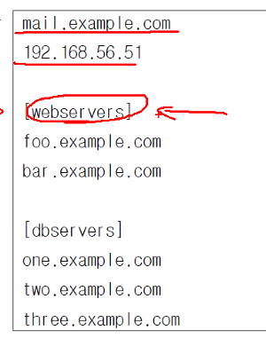

# 3. Ansible 기본

## 3.1 인벤토리

관리노드에 접속을 위한 호스트 파일이다.<br/>
INI 파일형식과 Yaml 방식이 있는데 일반적으로는 INI 방식을 사용함<br/>
YAML 은 띄어쓰기 들여쓰기에 민감하게 반응 하기 떄문에<br/>
INI가 작성이 쉽고 관습적으로 더 많이 사용함

섹션 === 그룹<br/>
<br/>
그룹에 속한 호스트는 파란 박스<br/>
가장 위의 섹션은 그룹이 없는 호스트

그룹안에 그룹이 들어갈 수 있고 중첩 그룹이라고 함

* tip YAML 파일 설정을 하자!<br/>
  .vimrc<br/>
```shell
# 문서 형식에 문법이 존재한다면 하이라이트를 켜라!
if has("syntax")
  syntax on
endif

set tabstop=2 # set ts=2와 동일, tab을 눌렀을 때 인식하는 칸 수
set expandtab # tab의 캐릭터를 space로 변환
set shiftwidth=2 # set sw=2와 동일, >, <를 사용한 탭 전환을 스페이스로 변환
```

하나의 호스트가 여러개의 그룹에 속할 수 있다.
```shell
all: # 기본으로 all 그룹이 있음
  hosts: # 속성값 (정해진 속성)
    mail.example.com:
    192.168.56.51:
  children: # all 그룹에 속한 하위 그룹들
   webservers: # 그룹이름 원하는 이름으로 지정 가능
     hosts:
       foo.example.com
       bar.example.com
...
```

* 그룹<br/>
Ungroup : INI 에서 [] 로 그룹을 지정하지 않았거나<br/>
YAML 에서 그룹을 지정하지 않은 호스트들<br/>
그외의 Group 들은 모두 all 그룹에 포함됨

`그룹명`을 prod 라는 하위 그룹 (children) 으로 설정
```shell
[prod:children]
그룹명
```

* 호스트 범위 지정
 ```shell
[webservers]
www[01:50].example.com
```
www01 www02 www03 ... www50

* vagrant ssh 접속
```shell
vagrant ssh <vm명>
```
베이그런트 이미지로 만들면 vagrant/vagrant 가 디폴트 사용자로 되어있음<br/>
ec2-user(aws), cloud-user(azure) : 각 클라우드 별 디폴트 유저명

* 인벤토리 파일 작성<br/>
vi inventory.ini
```shell
[mgmt]
192.168.200.101
192.168.200.102
```

* 인벤토리 파일을 지정해 주지 않으면<br/>
`/etc/ansible/hosts` 에 있는 호스트 목록이 출력됨
```shell
$ ansible all --list-hosts 
  hosts (3):
    10.10.10.10
    10.10.10.20
    10.10.10.30
```

* 인벤토리 파일을 지정하여 호스트 목록 출력
```shell
$ ansible all --list-hosts  -i inventory.ini 
  hosts (2):
    192.168.200.101
    192.168.200.102
```

* 그룹내의 호스트 리스트 조회
```shell
ansible <그룹명> --list-hosts
```

* ansible 인벤토리의 목록 조회
```shell
ansible-inventory -i inventory.init --list
```
```shell
$ ansile-inventory --list
{
    "_meta": {
        "hostvars": {}
    },
    "all": {
        "children": [
            "ungrouped"
        ]
    },
    "ungrouped": {
        "hosts": [
            "10.10.10.10",
            "10.10.10.20",
            "10.10.10.30"
        ]
    }
}

```

* 그룹에 따라 그래프 형태로 보여주기
```shell
ansible-inventory --graph
```

* 호스트나 그룹의 변수 목록 확인
```shell
ansible-inventory -i <인벤토리명> --host 호스트명
```
```shell
$ ansible-inventory -i inventory.ini --host 192.168.200.101
{}
```
현재는 아무런 변수가 없어서 나오는 것이 없음

* 정규화 표현식 이용
```shell
ansible '192.168.200.*' --list-hosts -i inventory.ini
```

* 패턴

그룹과 그룹을 짬뽕하지 마세요! 의도 하지 않은 일이 일어 날 수 있음!<br/>
필요하면 그룹을 따로 만드세요!

### 3.2 구성 파일

ansible의 작동방식을 구성하는 파일이다.
* Ansible 구성 파일 우선 순위
1. ANSIBLE_CONFIG 환경 변수
2. 현재 디렉토리의 ansible.cfg
3. 홈디렉토리의 ~/.ansible.cfg
4. /etc/ansible/ansible.cfg

* 현재 설정파일 위치 확인
```shell
$ ansible --version
ansible [core 2.11.5] 
  config file = /home/$USER/vagrant/ansible/ansible.cfg
```
```shell
$ touch /tmp/ansible.cfg
$ export ANSIBLE_CONFIG=/tmp/ansible.cfg
```
* 구성 파일 설정
```text
  [defaults] 섹션
- inventory : 인벤토리 파일 위치 지정
- remote_user : SSH 접속할 사용자 이름
- ask_pass : SSH 비밀번호 물어 볼지 설정 (기본 false / 기본으로 key 인증 방식 사용)
  [privilege_escalation] # 권한 상승 (su는 보안상 안좋아 ! sudo를 사용!)
become = true # false가 기본값!
become_method = sudo
become_user = root
become_ask_pass = false # 기본이 false이다! 패스워드 안물어본다.
패스워드 물어보는거는 자동화의 이점을 살리지 못하니깐 .. 쫌.. 
```

[privilege_escalation]
- become : 권한 상승 여부 (기본 : false)
- become_method : 권한 상승 방법 (기본 : sudo)
- become_user : 권한 상승할 사용자 (기본 : root)
- become_ask_pass : 권한 상승 방법의 패스워드 요청/입력 여부 (기본 : false)

Ansible은 기본적으로 root 계정을 사용하는데 기본계정을 일반 사용자로 접속 했다면<br/>
관리자 권한 필요한 작업을 해야하는데<br/>
이를 become 모듈이 가능하게 해줌.

관리하는 계정의 계정정보는 보통 동일하게 사용하면 좋을 걸~~ 가능하면!


베이그런트로 생성한 vm은 기본적으로 passwd less sudo가 설정되어 /etc/sudoers.d/vagrant 여기 등록됨

* `~/.ansible.cfg` 작성
```shell
[defaults]
remote_user = vagrant
inventory = ~/inventory.ini
ask_pass = false

[privilege_escalation]
become = false
become_method = sudo
become_user = root
become_ask_pass = false
```

* `~/inventory.ini` 작성
```shell
[mgmt]
192.168.200.101
192.168.200.102
```

* 현재가장 우선 순위가 높은 config 파일 보여줌
```shell
ansible-config view
```

* ansible에서 설정가능한 모든 설정들을 보여줌
```shell
ansible-config list
```

* 현재 적용된 모든 구성정보 확인
```shell
ansible-config dump
```
초록이 : 변경 없는 기본값

## 3.3 관리노드 연결
ansible의 제어노드는 기본적으로 openssh로 관리노드에 접근함<br/>
OpenSSH 에는 ControlPersist (성능 향상 기능) 옵션을 지원함.<br/>

간혹 오래된 OpenSSH 의 경우 ControlPersist 을 지원하지 않응 경우가 있음.<br/>
ansible 사용 시 Python 자체에서 구현된 paramiko 라는 애가 SSH 구현으로 대체됨.

### 1) 인증
* SSH 키 생성 후 접속 대상에 공개키를 복사한다.
```shell
ssh-keygen -t rsa -f ~/.ssh/id_rsa -N ''
ssh-copy-id vagrant@192.168.200.101
ssh-copy-id vagrant@192.168.200.102
```

* 접속할 대상의 공개키 확인하는 명령어
```shell
ssh-keyscan -t rsa 192.168.200.101
```

* SSH 접속 사용자 변경<br/>
- Ansible 구성 파일<br/>
  remote_user = 사용자명<br/>
- ansible 명령 -u 사용자명 또는 --user 사용자명

### 2) 권한상승
  기본적으로 become 이 되지 않도록 막아 놓는다.<br/>
  -K, --ask-become-option

### 3) SSH 이외 다른 연결 방법

* 주요 연결 플러그인<br/>
1) docker<br/>
2) kubectl<br/>
3) local : 내가 관리 노드이자 컨트롤플레인인경우 이걸쓰면 빠를 수 있어<br/>
   연결 방식을 local 로 하면 SSH 연결을 따로 하지 않고 프로세스 방식으로 접속한다.<br/>
   SSH 로 인한 성능 저하 방지<br/>
4) network_cli : 일부 네트워크 장비에는 파이썬이 없어! 고럴 때 사용하는거<br/>
5) paramiko_ssh : 파이썬의 ssh 구현체<br/>
6) ssh (기본값)<br/>
7) winrm : 윈도우의 접속방식

* Ansible 사용법 확인<br/>
공식 홈페이지에 나오지 않은 상세한 정보도 확인 가능
```shell
ansible-doc -t
# t : 플러그인명이라고 하기도 함
# l : 리스트를 보겠다.
```
- conenction 플러그인 목록 보기
```shell
ansible-doc -t connection -l
```

* 호스트마다 접속 방식을 인벤토리 파일에 작성하여 바꿀 수 있댜<br/>
ansible_connection=ssh 가 기본값<br/>
ansible_connection=local 로 하면 local 연결 방식으로 변경됨<br/>
local 방식으로 설정하면 tcp 통신을 하지 않고 바로 프로세스를 띄워서 연결하므로 네트워트 지연이 발생하지 않음

```shell
192.168.200.1 ansible_connection=local

[mgmt]
192.168.200.101
192.168.200.102
```

## 3.4 이번주 학습의 포인트 !! 🚗 모듈 🚗
### 1) ansible-doc 명령어 사용
```shell
ansible-doc -t module -l | wc -l
3387
```
와우 모듈이 무려 3000개 이상이다! 

* 모듈 간단히 사용해보기
```shell
azwell@azwell-KVM:~$ ansible 192.168.200.101 -m command -a id
192.168.200.101 | CHANGED | rc=0 >>
uid=1000(vagrant) gid=1000(vagrant) groups=1000(vagrant)
```
command 목적은 원격에다가 명령을 실행해주는 모듈<br/>
-a : argument. 실행할 명령을 써넣는다.

그룹명을 지정하여 해당 그룹에 해당되는 호스트들에 다 실행하게 할 수도 있다!
```shell
azwell@azwell-KVM:~$ ansible mgmt -m command -a hostname
192.168.200.101 | CHANGED | rc=0 >>
node1
192.168.200.102 | CHANGED | rc=0 >>
node2
```

-b 옵션을 주면 become 을 수행 (기본값 true)<br/>
관리자 권한을 수행한다.<br/>
보안상 기본적으로 사용하지 않는 것을 권장.<br/>
```shell
$ ansible mgmt -m command -a id -b
192.168.200.101 | CHANGED | rc=0 >>
uid=0(root) gid=0(root) 그룹들=0(root)
192.168.200.102 | CHANGED | rc=0 >>
uid=0(root) gid=0(root) 그룹들=0(root)
```

쌤과 버전차이가 나서 그런지 모르겠지만<br/>
쌤은 에러나고 우리는 sudo 권한이 패스워드 없이 잘 됨<br/>
확인해보니 vagrant 가 sudoers 에 등록 되어 있음<br/>
```shell
$ sudo -i
root@node1:~# cd /etc/sudoers.d/
root@node1:/etc/sudoers.d# ls
90-cloud-init-users  README  vagrant
root@node1:/etc/sudoers.d# cat vagrant 
vagrant ALL=(ALL) NOPASSWD:ALL
```

```shell
azwell@azwell-KVM:~$ ansible all -m command -a hostname --become
192.168.200.1 | FAILED | rc=-1 >>
Failed to set permissions on the temporary files Ansible needs to create when becoming an unprivileged user (rc: 1, err: chown: invalid user: ‘vagrant’
}). For information on working around this, see https://docs.ansible.com/ansible/become.html#becoming-an-unprivileged-user
192.168.200.101 | CHANGED | rc=0 >>
node1
192.168.200.102 | CHANGED | rc=0 >>
node2
```

### 2) 자주 사용되는 모듈
* 명령 모듈
- command
- script
- shell
- raw: 옛날 Cisco IOS 같은 장비들에 쉘이나 파이썬이 없어 그럴 경우 사용<br/>
command 모듈과 shell 모듈은 안사용하는게 좋음<br/>
왜냐? 이거 쓸거면 모하러 Ansible씀..?! > 원하는 모듈이 없는 경우 어쩔 수 없이 사용하고

* 파일 모듈
- blockline: 텍스트 파일에 블록 삽입/업데이트/삭제
- copy : 파일 복사
- lineinfile : 텍스트 파일에 행광리
- replace : 텍스트 파일의 문자열 관리
- synchronize : rsync 동기화

* 네트워크 모듈
- get_url : HTTP/S, FTP 파일 다운로드(wget)
- uri : 웹 서비스와 상호작용 (curl)

* 패키지 모듈
- apt
- dnf
- yum
- npm
- pip
  ...

* 소스제어 모듈
- git
- github_
- gitlab_
- bitbucet_
...

* 시스템 모듈
- cron
- filesystem
- firewalld
- iptables
- lvg
- lvol
- mount
- parted
- ping
- reboot
- service
- ufw

* cron 모듈 예시<br/>
  해당 노드의 cron 서비스를 stop 해보자
```shell
azwell@azwell-KVM:~$ ansible 192.168.200.101 -m service -a 'name=cron state=stopped'
192.168.200.101 | FAILED! => {
    "ansible_facts": {
        "discovered_interpreter_python": "/usr/bin/python3"
    },
    "changed": false,
    "msg": "Unable to stop service cron: Failed to stop cron.service: Connection timed out\nSee system logs and 'systemctl status cron.service' for details.\n"
}

```

### 3) 기타 플러그인 확인
- become
- cache
- callback
- cliconf
- connenction
- httpapi
- inventory
- netconf
- lookup
- shell
- module
- strategy
- vars

ansible 모듈 중에서 free_form 이라고 붙은거는<br/>
자유양식이라는 거임 딱히 뭐 아규먼트를 의미하는거가 아님<br/>
command 모듈은 default 모듈이라서 안적어도 됨<br/>
-m command 옵션을 주지 않고 -a '명령어' 만 주어도 해당 노드에서 명령이 실행된다!

* 노드 재부팅 때리기!
```shell
ansible 192.168.200.101 -a '/sbin/reboot' -b
```
또는 reboot 모듈 사용하기
```shell
ansible 192.168.200.101 -m reboot -b
```
기본으로 600초 (10분)를 대기해서 될때 까지 재부팅을 시도한다.


* 실습용 ini
```shell
192.168.200.1 ansible_connection=local

[mgmt]
192.168.200.101
192.168.200.102
```

* 실습용 cfg
```shell
[defaults]
remote_user = varant
inventory = ~/inventory.ini
ask_pass = false

[privilege_Escalation]
become = false
become_method = sudo
become_user = root
become_ask_pass = false
```