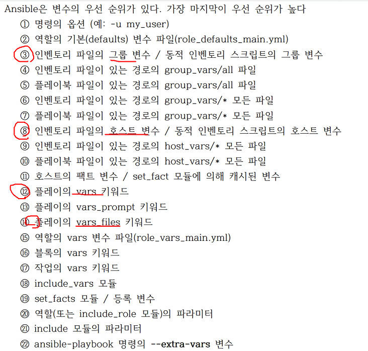

# 5. 변수
##  5.1 변수
### 1) 변수 이름
### 2) 변수 정의 및 참조
변수를 참조할떄는 반드시 이중 중괄호를 써야함

변수가 참조하는 사전의 모든값을 따옴표로 감쌈<br/>
ex) '{{ variable }}/foo.cfg'

#### (1) 기본 변수
- 기본 변수 정의
```yaml
remote_install_path: /opt/my_app_config
```
- 기본 변수 참조
```yaml
template:
  src: foo.cfg.j2
  dest: '{{ remote_install_path }}/foo.cfg'
```

#### (2) 목록 변수
- 목록 변수 정의
```yaml
region:
  - north
  - east
  - south
```

- 목록 변수 참조
```yaml
region: "{{ region[0] }}"
```
값은 'northeast' 다

#### (3) 사전 변수
* 사전 변수 정의
```yaml
foo:
  field1: one
  filed2: two
```

* 사전 변수 참조
```yaml
foo['field1']
foo.filed1
```
점표기법은 모듈에 따라 일부 키가 Python 에 정의된 속성 및 메서드와 충돌날 위험이 있음

#### (4) 등록 변수
* 등록 변수 사용
  반환 값을 참조하는 유일한 방법
```yaml
- hosts: web_Servers
  tasks:
    - name: Run a shell command and register its outputas a variable
      shell: /usr/bin/foo
      register: foo_result
      ignore_errors: true

    - name: Run a shell comand using output of the previous task
      shell: /usr/bin/bar
      when: foo_result.rc == 5
```
/usr/bin/foo 의 리턴 value 가 foo_result 변수에 저장됨


### 3) 변수 정의 위치
Ansible에서 변수를 정의할 수 있는 곳만 30군데가 됨..<br/>
어떻게 기억해..! 그래도 우리가 변수가 미치는 범위를 기억해야해
* 인벤토리
* 플레이북, 플레이, 작업
* 재사용 가능 파일(외부 참조 파일)
* 역할
* 명령의 -e 옵션

인벤토리와 플레이북에 가장 많이 설정함<br/>
인벤토리에 선언하는 건 호스트나 그룹을 따라감

#### (1) 인벤토리 - 호스트 변수
```ini
[atlanta]
host1 http_port=80 maxRequestsPerChild=808
host2 http_port=303 maxRequestsPerChild=909
```

```yaml
atlanta:
 host1:
   http_port: 80
   maxRequestsPerChild: 808
 host2:
  http_port: 303
  maxRequestsPerChild: 909
```
#### (2) 인벤토리 - 그룹 변수
* INI 형식
```ini
[mgmt:vars]
ntp_server=ntp.mgmt.example.com
proxy=proxy.mgmt.example.com
```

* YAML 형식
```yaml
mgmt:
  hosts:
    host1: 
    host2:
  vars:
    ntp_server: ntp.mgmt.example.com
    proxy: proxy.mgmt.example.com
```


#### (3) 플레이북 - 변수
가장 많이 쓰는 방식
플레이에 vars 키워드를 사용하여 변수를 지정
```yaml
- hosts: webservers
  vars:
    http_port: 80
  tasks:
    - name: ensure apache is at latest version
      apt:
...
```

#### (4) 플레이북 - 변수 파일 포함
vars_files:

```yaml
vars_files:
  - vars/external_vars.yaml
```

#### (5) 런타임
ansible-playbook 명령에 --extra-vars 또는 -e 옵션을 사용하여 변수 지정


### 4) 변수 우선순위



- 변수 참조 테스트 1
```yaml
- name: variables
  hosts: 192.168.200.101
  vars:
     msg: hello world
  tasks:
  - debug:
      var: msg # 값으로 변수 이름을 받는다. (참조가 아님!!)
  - debug:
      msg: '{{ msg }}' # 변수의 값을 참조
```

인벤토리에서 vars 를 지정핻 playbook 이 우선순위가 더 높기 떄문에
vars 바 바뀌지 않는다.

```shell
$ cat ~/inventory.ini
192.168.200.101 ansible_connection=local
192.168.200.102 ansible_connection=local

[mgmt]
192.168.200.101 msg=node1
192.168.200.102 msg-node2
```

```shell
$ ansible-playbook vars.yaml 
PLAY [variables] ***************************************************************************************

TASK [Gathering Facts] *********************************************************************************
ok: [192.168.200.101]

TASK [debug] *******************************************************************************************
ok: [192.168.200.101] => {
    "msg": "hello world"
}

TASK [debug] *******************************************************************************************
ok: [192.168.200.101] => {
    "msg": "hello world"
}

PLAY RECAP *********************************************************************************************
192.168.200.101            : ok=3    changed=0    unreachable=0    failed=0    skipped=0    rescued=0    ignored=0   
```


- 변수 참조 테스트 2
```yaml
- name: variables
  hosts: 192.168.200.101
  vars:
     msg: hello world
  tasks:
  - copy:
      src: /etc/hosts
      dest: /tmp/hosts
    register: copy_result
  - debug:
      msg: '{{ copy_result.checksum }}' # 변수의 값을 참조
```

```shell
$ ansible-playbook vars_register.yaml 
PLAY [variables] ***************************************************************************************

TASK [Gathering Facts] *********************************************************************************
ok: [192.168.200.101]

TASK [copy] ********************************************************************************************
ok: [192.168.200.101]

TASK [debug] *******************************************************************************************
ok: [192.168.200.101] => {
    "msg": "50100d015c43988b499b8a208bba744d9c44840b"
}

PLAY RECAP*********************************************************************************************
192.168.200.101            : ok=3    changed=0    unreachable=0    failed=0    skipped=0    rescued=0    ignored=0   
```

* Part4에서 했던 php 배포 실습 playbook을 변수로 지정!

* Simple Web Deploy
```yaml
- name: Simple Web Deploy
  hosts: 192.168.200.101
  vars:
    contents_file: index.php

  tasks:
  - name: Install Pacakge
    apt:
      name: apache2, libapache2-mod-php
      update_cache: true
      state: present

  - name: Copy PHP Contents
    copy:
      src: '{{ contents_file }}'
      dest: '/var/www/html/{{ contents_file }}'
      backup: true

  - name: Start Service
    service:
      name: apache2
      state: started
      enabled: true

  - name: Checking
    uri:
      url: "http://192.168.200.101/{{ contents_file }}"

```

### 5) 변수의 범위
변수를 어디에 저장하느냐에 따라 변수를 참조할 수 있는 범위가 한정됨,

- 전역/플레이북: 구성파일, 환경변수(ansible_*), 명령줄 옵션
- 호스트 그룹: 인벤토리의 그룹 변수
- 호스트: 인벤토리의 호스트 변수
- 플레이: vars, vars_files, vars_prompt 등 지시어, 역할의 기본 변수 (defaults) 및 변수 (vars)
- 블록
- 작업

### 6) 변수 정의 위치에 대한 팁
- group_vars/all: 모든 호스트에 공통적으로 적용할 변수 설정
- group_vars/<specific_group>: 특정 호스트 그룹에 공통적으로 적용
- host_vars/<host>: 특정 호스트에만 적용할 변수 설정
- 특정 작업에만 적용할 변수 설정

## 5.2  조회
* 플러그인 목록
```shell
ansible-doc -t lookip -l
```
lookup 플러그인은 모듈이 아님

* 파일 조회 플러그인을 이용
```yaml
- hosts: databases
  vars:
    auth_key: "{{ 'lookup('file', '/home/devops/.ssh/id_rsa.pub') }}"

  tasks:
    - name: set authrized keys
      authorized_key:
        user: devops
        state: present
        key: "{{ auth_key }}"
```

## 5.3 프롬프트
vars_prompt 로 키워드에 변수를 선언시 사용자에게 입력값을 받을 수 있도록 함

```yaml
- hosts: all
  vars_prompt:
    - name: username
      prompt: Enter usernmae
      private: no
      default: admin
    - name: hashed_password
      prompt: Enter password
      private: yes
      encrypt: sha512_crypt
      confirm: yes
      salt_size: 16

  tasks:
    - name: create_user
      user:
        name: "{{ username }}"
        password: "{{ hashed_password }}"
```

user 모듈은 사용자 생성 삭제하는 모듈<br/>
name 속성은 필수이며 password 는 Encrypted 된 값이 들어가야 한다.

## 5.4 필터
### 1) 기본값 제공
* 필터<br/>
  `{{ 변수 | default('DEFAULT') }}`
* 출력<br/>
  `DEFAULT`
### 2) 필수값 정의
* 필터<br/>
  mandatory : 이 변수에는 필수 값이 들어가야 한다!!하고 지정
  `{{ variable | mandatory }}`

### 3) 사전 - 목록 데이터 변환


### 4) JSON 퀴리

### 5) IP 주소 필터
`{{ '192.168.2.1/24' | ipaddr('address') }}`
address 값만 출력된다.<br/>
192.168.2.1

`{{ 'test1' | hash('sha1') }}`

salt 값 지정
`{{ 'test1' | password_hash('sha256', 'myscretsalt') }}`

### 7) ⭐⭐⭐ 주석 필터
* 필터
  `{{ "Plain style (default)" | comment }}`

* Ansible 필터 주석 사용
  `{{ ansible_manages | comment }}`

### 8) URL 필터


### 9) 정규화 표현식 필터


### 10) 경로 필터


## 5.5 팩트 변수
### 1) Ad-hoc 명령에서 팩트 변수 확인
Playbook 이 실행되면 setup 모듈이 실행되면서<br/>
시스템 정보들이 JSON 형태로 변수 저장됨.

아래 명령어 치면 확인 해 볼 수 있음.
`ansible 192.168.200.101 -m setup`

### 2) 팩트 변수 참조
`ansible_`로 시작하는 변수로 접근 가능

`{{ ansible_all_ipv4_address }}` : 시스템에 설정된 IPv4 목록 가져옴

ansible <아이피> -m setup > factor.txt

```yaml
---
- hosts:
  tasks:
    - debug:
        msg: ' {{ ansible_enp0s8.ipv4.address }}'
```

* 꿀팁
  callback_whitelist = profile_tasks

옵티마이즈 할때 cfg에 적어서..

## 5.7 템플릿
중요하다! Ansible에서 템플릿을 사용하는 이유는 설정파일르 동적으로 생성하기 위함
주로 jinja를 사용한다! .j2, .jinja2 확장자~


~/ansible.cfg 의 defaults 섹션에 아래 내용 추가하면<br/>
기본 ansible_managed 의 주석을 바꿀수 있음.
```
ansible_managed = Ansible managed: {file} modified on %Y-%m-%d %H:%M:%S by {uid} on {host} {file}
```

```ini
remote_user = vagrant
inventory = ~/inventory.ini
ask_pass = false
callback_whitelist = profile_tasks
ansible_managed = Ansible managed: {file} modified on %Y-%m-%d %H:%M:%s <- 이거 ansible.cfg에서 가져온거
```


---

* 실습
/etc/apache2/ports.conf
파일의 Listen 포트를 변수처리하고 Ansible이 관리하는 템플릿 파일로 만들어 보자!

- 개인 실습 1<br/>
먼저 apache2 설정 파일들을 가져오자
```shell
scp vagrant@192.168.200.101:/etc/apache2/ports.conf .
scp vagrant@192.168.200.101:etc/apache2/sites-available/000-default.conf .
```

ports.conf 를 다음과 같이 수정
```conf
# If you just change the port or add more ports here, you will likely also
# have to change the VirtualHost statement in
# /etc/apache2/sites-enabled/000-default.conf

Listen {{ http_port }}

<IfModule ssl_module>
	Listen 443
</IfModule>

<IfModule mod_gnutls.c>
	Listen 443
</IfModule>

# vim: syntax=apache ts=4 sw=4 sts=4 sr noet
```

000-default.conf 를 다음과 같이 수정
```conf
<VirtualHost *:{{ http_port}}>
	# The ServerName directive sets the request scheme, hostname and port that
	# the server uses to identify itself. This is used when creating
	# redirection URLs. In the context of virtual hosts, the ServerName
	# specifies what hostname must appear in the request's Host: header to
	# match this virtual host. For the default virtual host (this file) this
	# value is not decisive as it is used as a last resort host regardless.
	# However, you must set it for any further virtual host explicitly.
	#ServerName www.example.com

	ServerAdmin webmaster@localhost
	DocumentRoot /var/www/html

	# Available loglevels: trace8, ..., trace1, debug, info, notice, warn,
	# error, crit, alert, emerg.
	# It is also possible to configure the loglevel for particular
	# modules, e.g.
	#LogLevel info ssl:warn

	ErrorLog ${APACHE_LOG_DIR}/error.log
	CustomLog ${APACHE_LOG_DIR}/access.log combined

	# For most configuration files from conf-available/, which are
	# enabled or disabled at a global level, it is possible to
	# include a line for only one particular virtual host. For example the
	# following line enables the CGI configuration for this host only
	# after it has been globally disabled with "a2disconf".
	#Include conf-available/serve-cgi-bin.conf
</VirtualHost>

# vim: syntax=apache ts=4 sw=4 sts=4 sr noet
```

playbook YAML 파일 작성
```yaml
- name: Simple Web Deploy
  hosts: 192.168.200.101
  vars:
    http_port: 8080

  tasks:
  - template:
      src: ./ports.conf
      dest: /etc/apache2/ports.conf
  - template:
      src: ./000-default.conf
      dest: /etc/apache2/sites-available/000-default.conf
  - name: Restart Service
    service:
      name: apache2
      state: restarted
      enabled: true

  - name: Checking
    uri:
      url: "http://192.168.200.101:{{ http_port }}"
```

- 선생님의 실습
```yaml
---
- name: Simple Web Deploy
  hosts: 192.168.200.101
  vars:
    contents_file: index.php
    apache_port: "8080"

  tasks:
  - name: Install Pacakge
    apt:
      name: apache2, libapache2-mod-php
      update_cache: true
      state: present

  - name: Copy PHP Contents
    copy:
      src: '{{ contents_file }}'
      dest: '/var/www/html/{{ contents_file }}'
      backup: true

  - name: Configure Apache Port
    template:
      src: ports.conf.j2
      dest: '/etc/apache2/ports.conf'

  - name: Start Service
    service:
      name: apache2
      state: restarted
      enabled: true

  - name: Checking
    uri:
      url: "http://192.168.200.101:{{ apache_port }}/{{ contents_file }}"
```

설정파일을 바꿨기 때문에 서비스 재시작이 필요 state 부분이 started 가 아닌 restarted 가 되어야 한다.

단 이렇게 하면 멱등성이 적용되지 않는다.
근데 그렇게 오래 걸리지 않기 때문에 뭐 계속 재시작하도록 설정하였다.