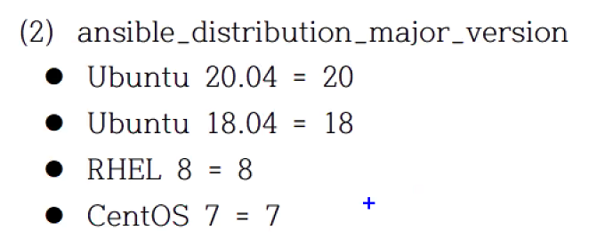
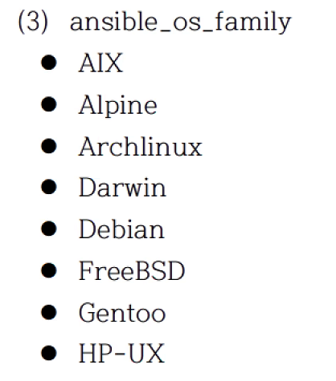

# 작업 제어 - 기본

## 6.1 반복문
ansible 2.4 까지는 with_* 사용하였었는데<br/>
ansible 2.5 부터 loop를 추가함

loop 키워드를 사용하면 기존의 with_* 키워드로 했던게 일부 안되는 경우가 있음.

변수의 값을 받는 변수명은 항상 item 이다!<br/>
반복문에서 제공되는 목록을 참조하는 변수는 항상 item 이다

```yaml
- hosts: 192.168.200.101
  tasks:
    - debug:
        msg: "{{ item }}"
      loop:
        - one
        - two
        - three
```
```shell
$ ansible-playbook loop.yaml 
PLAY [192.168.200.101] *********************************************************************************

TASK [Gathering Facts] *********************************************************************************
ok: [192.168.200.101]

TASK [debug] *******************************************************************************************
ok: [192.168.200.101] => (item=one) => {
    "msg": "one"
}
ok: [192.168.200.101] => (item=two) => {
    "msg": "two"
}
ok: [192.168.200.101] => (item=three) => {
    "msg": "three"
}

PLAY RECAP *********************************************************************************************
192.168.200.101            : ok=2    changed=0    unreachable=0    failed=0    skipped=0    rescued=0    ignored=0  
```

```yaml
- hosts: 192.168.200.101
  vars:
    loop_list:
      - one
      - two
      - three
  tasks:
    - debug:
        msg: "{{ item }}"
      loop:
        "{{ loop_list }}"
```
### 1) 단순반복

패키지를 설치하는 곳에 반복문을 실행하면 오히려 오래걸림, 걍 컴마로 나열하셈!

명령이 한번만 실행됨: apt install apache2,php
명령이 2번 실행됨: apt install apache2; apt install php # 반복문 사용하면 요로케.. 성능에 마이너스~

모듈에 따라서 리스트로 받을수 있는 모듈이 있고 안되는 모듈이 있음

### 2) 사전 목록 반복
```yaml
- name: add several users
  user:
    name: "{{ item.name }}"
    state: present
    groups: "{{ item.groups }}"
  loop:
    - { name: 'testuser1', groups: 'wheel' }
    - { name: 'testuser2', groups: 'root' }
```
item.<dict_key> 형식으로 참조
user 모듈이 2번 실행됨

### 3) 중첩 목록 반복
데카르트의 곱... product

총 6번이 실행됨

alice 의 clientdb8<br/>
alice 의 employeedb<br/>
alice 의 providerdb<br/>
bob 의 clientdb<br/>
bob 의 employeedb<br/>
bob 의 providerdb<br/>

### 4) 인벤토리 반복
```yaml
- debug:
    msg: "{{ }}"

```
인벤토리 호스트 쿼리하여 사용 가능


## 6.2 조건문
변수의 값이 test_name 이면 실행을 하거라
```yaml
- debug:
    msg: hello world
  when: variable is test_name
```


### 1) 테스트
참인지 거짓인지 평가<br/>
Ansible 플레이북 실행 후 마지막에 recap 부분에 skip 이뜨면 넘어간 task임

#### (2) 버전 비교 테스트
```yaml
when: ansible_facts['distribution_version'] is version('12.04', '>=')
```

#### (3) 경로 테스트

- dir: is directory
- file: is file
- symlink: is link
- exist: is exist
- same compare: is samefile(path)
- mount: is mount

#### (4) 이전 작업의 결과 테스트
ignore_errors: True<br/>
이전 작업이 실패하든 말든~ 다음으로 넘어간다

result is successed 변경 사항 없지만 성공

- failed: result is failed
- changes: is changes
- succeeded: result is succeeded
- skipped: result is skipped


### 2) 조건문
너무나도 많이 사용한다.

#### (1) 기본 조건문
#### (2) 팩트 변수 기반의 조건문
멀티 os 기반의 모듈을 실행해야할 때 정말 많이 사용하는 조건문
`when: ansible_facts['os_family']` == "Debian"
distribution 도 체크

- OS가 어떤 계열 인지 확인 (Debian/Redhat)
  `ansible_facts['os_family'] == 'Debian'`

- OS 배포판 확인
  `ansible_facts['distribution'] == 'CentOS'`

- OS 배포판 버젼 확인
  `ansible_facts['distribution_major_version'] == '7'`

여러 조건 목록으로 표현하면 and 연산이 적용 or 연산은 없음


#### (3) 등록 변수 기반의 조건문

## 3) 조건문에 자주 사용되는 팩트와 변수값






* 실습
```yaml
---
- name: Simple Web Deploy
  hosts: 192.168.200.101
  vars:
    contents_file: index.php
    apache_port: "8080"

  tasks:
  - name: Install Pacakge for Ubuntu
    apt:
      name: apache2, libapache2-mod-php
      update_cache: true
      state: present
    when: ansible_distribution == "Ubuntu"
  
  - name: Install Package for CentOS
    yum:
      name: httpd, mod-php
      state: present
    when: ansible_distribution == "CentOS"

  - name: Copy PHP Contents
    copy:
      src: '{{ contents_file }}'
      dest: '/var/www/html/{{ contents_file }}'
      backup: true

  - name: Configure Apache Port
    template:
      src: ports.conf.j2
      dest: '/etc/apache2/ports.conf'

  - name: Start Service
    service:
      name: apache2
      state: restarted
      enabled: true

  - name: Checking
    uri:
      url: "http://192.168.200.101:{{ apache_port }}/{{ contents_file }}"
```

## 6.3 핸들러
작업을 실행하고 시스템에 반드시 변경(Change)이 있을 때 별도의 작업을 호출하고 실행
### 1) 핸들러 예
```yaml
---
- name: Verify apache installation
  hosts: webservers
  vars:
    http_port: 80
    max_clients: 200
  remote_user: root

  tasks:
    - name: Ensure apache is at the latest version
      yum:
        name: httpd
        state: latest
    - name: Write the apache config file
      template:
        src: /src/httpd.j2
    ....
```
apache 포트를 변경하고 그때에만 restart 하고 싶다?! 그럴때 사용

```yaml
---
- hosts:
  tasks:
  - template:
      src: a.j2
      dest: /etc/a.conf
    notify:
    - restart service

  handlers:
  - name: restart service
    service:
      name: apache
      state: restarted
~                         
```

* 실습
```yaml
---
- name: Simple Web Deploy
  hosts: 192.168.200.101
  vars:
    contents_file: index.php
    apache_port: "8080"

  tasks:
  - name: Install Pacakge for Ubuntu
    apt:
      name: apache2, libapache2-mod-php
      update_cache: true
      state: present
    when: ansible_distribution == "Ubuntu"
  
  - name: Install Package for CentOS
    yum:
      name: httpd, mod-php
      state: present
    when: ansible_distribution == "CentOS"

  - name: Copy PHP Contents
    copy:
      src: '{{ contents_file }}'
      dest: '/var/www/html/{{ contents_file }}'
      backup: true

  - name: Configure Apache Port
    template:
      src: ports.conf.j2
      dest: '/etc/apache2/ports.conf'
    notify:
    - Restart Service

  - name: Start Service
    service:
      name: apache2
      state: started
      enabled: true

  - name: Checking
    uri:
      url: "http://192.168.200.101:{{ apache_port }}/{{ contents_file }}"
    ignore_errors: true
    
  handlers:
  - name: Restart Service
    service:
      name: apache2
      state: restarted
```
ignore_errors: 이거 말고 다른 우회 방법을 나중에 해준다.

template 모듈이 change 상태일 때 notify 되면서 handler가 동작함<br/>
Ansible에서 핸들러는 대부분 서비스를 재시작하는거 말고는 없다.<br/>
다른 용도로도 쓸 수 있다고 한다.

task가 모두 끝나야만 핸들러가 동작한다! 이걸 꼭 기억하자!

#### (2) 다중 알림 (수신)
알림을 보낼 notify가 여러개일 때는 listen 키워드를 사용해도 좋다.<br/>
이름을 따로 주고 싶기 때문.

작업 알림에 변수를 사용할 수 있지만 원칙적으로 사용하지 않는 것이 좋다.<br/>
왜냐면 알림이 안 갈 우려가 있다.

### 2) 작업과 핸들러의 실행 순서
* 핸들러는 플레이의 모든 작업이 완료된 후 핸들러 작업을 실행한다.<br/>
* 핸들럭 작업의 순서는 알림을 받은 순서가 아니라 순차적으로 실행된다.<br/>
* 알림을 받은 핸들러만 실행된다.<br/>
* 알림을 2번 이상 받더라도 한번만 실행된다.<br/>
* 정적, 동적 핸들러 관련은 이후에... (to be continue...)

## 6.4 위임
저기 위에 예시를 보면 uri 모듈에서 자기가 자신한테 체크를 하고 있다. <br/>
그런데 방화벽 설정 고런거 있으면 저렇게 체크하는게 의미가 있나? <br/>
단순하게 새로운 플레이를 만들어서 할 수도 있지만<br/>
delegate_to 속성을 이용하면 다른 시스템에다가 진행을 시킬 수 있다아.<br/>
그리고 다른 예시로는 로드밸런싱 되고 있던 서버의 포트를 바꾸는 작업을 작성했다 치자<br/>
그러면 포트의 설정을 바꾸는 작업을 하고 로드 밸런서 한테 설정 적용을 위임하는 식으로 사용한다.

다른 노드 또는 로드밸런서에서 명령을 <br/>
대신 샐행하도록 함.

### 1) 위임 할 수 없는 모듈
- include
- add_host
- debug

### 2) 작업의 위임

### 3) 팩트 수집 위임
```yaml
...
setup:
delegate_to: "{{ item }}"
delegate_facts: true
...
```
setup 모듈을 사용해서 다른 시스템의 facts 변수들을 가져 올 수 있다.<br/>
단 이렇게 할 경우 delegate_facts: true 를 반드시 지정해 주어야 한다.

## 6.5 블록
작업을 하나의 논리적인 작업으로 묶는 기능을 함

task 들을 하나의 블록으로 묶어서 조건문을 걸고<br/>
특정 OS, 특정 배포판 버젼에서만 실행되는 식으로 할 수 있다!

```yaml
tasks:
  - name: Multiple tasks..
  block:
   - name: Install Apache2
     apt:
       name: apache2
   - name: ~~~
      apt:
        name: ~~~
 when: ansible_facts['distribution'] == 'Ubuntu'
 become: true
 ignore_errors: yes
```

block, rescue, always 섹션이 존재

* rescue
블록의 작업중 하나라도 실패가 있으면<br/>
rescue 섹션으로 실행됨.<br/>
모두 성공하면 실행 안함.

* always
성공하던 실패하던 항상 실행

* rescue + always
실패 있으면 rescue 실행<br/>
항상 실행 할 것은 always 에 써

### 5) 실패처리 - 핸들러
handler가 달린 테스크가 성공전에 실패한다묜?<br/>
그럼 핸들러가 실행되지 않아요!<br/>
그래서 rescue에 meta에 flush_handlers<br/>
이거 쓰면은 어떻게든 핸들러가 실행됨<br/>
이 형태는 자주사용되는 형태이다! 알아두면 써먹기 좋다.

meta 모듈<br/>
meta action : Ansible 의 동작을 로우 레벨에서 제어<br/>
meta: flush_handlers 를 하면 핸들러가 무조건 실행된다.<br/>
많이 사용하니 꼭 알아 두라고 하신다.

명령어 여러개 있긴한데 쎔은<br/>
flush_handlers 만 주로 써봤다하심!

* rescue 실행됨 task3에서 실패
```yaml
- hosts: 192.168.200.101
  tasks:
  - block:
    - name: TASK1
      debug:
    - name: TASK2
      debug:
    - name: TASK3
      command: xxx
    rescue:
      - name: RESCUE1
        debug:
      - name: RESCUE2
        debug:
    always:
    - name: ALWAYS1
      debug:
```
```shell
PLAY [192.168.200.101] *********************************************************************************

TASK [Gathering Facts] *********************************************************************************
ok: [192.168.200.101]

TASK [TASK1] *******************************************************************************************
ok: [192.168.200.101] => {
    "msg": "Hello world!"
}

TASK [TASK2] *******************************************************************************************
ok: [192.168.200.101] => {
    "msg": "Hello world!"
}

TASK [TASK3] *******************************************************************************************
fatal: [192.168.200.101]: FAILED! => {"changed": false, "cmd": "xxx", "msg": "[Errno 2] No such file or directory: b'xxx'", "rc": 2, "stderr": "", "stderr_lines": [], "stdout": "", "stdout_lines": []}

TASK [RESCUE1] *****************************************************************************************
ok: [192.168.200.101] => {
    "msg": "Hello world!"
}

TASK [RESCUE2] *****************************************************************************************
ok: [192.168.200.101] => {
    "msg": "Hello world!"
}

TASK [ALWAYS1] *****************************************************************************************
ok: [192.168.200.101] => {
    "msg": "Hello world!"
}

PLAY RECAP *********************************************************************************************
192.168.200.101            : ok=6    changed=0    unreachable=0    failed=0    skipped=0    rescued=1    ignored=0  
```

* rescue 실행 안됨 task 모두 성공
```yaml
- hosts: 192.168.200.101
  tasks:
  - block:
    - name: TASK1
      debug:
    - name: TASK2
      debug:
    - name: TASK3
      debug:
    rescue:
      - name: RESCUE1
        debug:
      - name: RESCUE2
        debug:
    always:
    - name: ALWAYS1
      debug:
```
```shell

PLAY [192.168.200.101] ***************************************************************************************************

TASK [Gathering Facts] ***************************************************************************************************
ok: [192.168.200.101]

TASK [TASK1] *************************************************************************************************************
ok: [192.168.200.101] => {
    "msg": "Hello world!"
}

TASK [TASK2] *************************************************************************************************************
ok: [192.168.200.101] => {
    "msg": "Hello world!"
}

TASK [TASK3] *************************************************************************************************************
ok: [192.168.200.101] => {
    "msg": "Hello world!"
}

TASK [ALWAYS1] ***********************************************************************************************************
ok: [192.168.200.101] => {
    "msg": "Hello world!"
}

PLAY RECAP ***************************************************************************************************************
192.168.200.101            : ok=5    changed=0    unreachable=0    failed=0    skipped=0    rescued=0    ignored=0   
```
