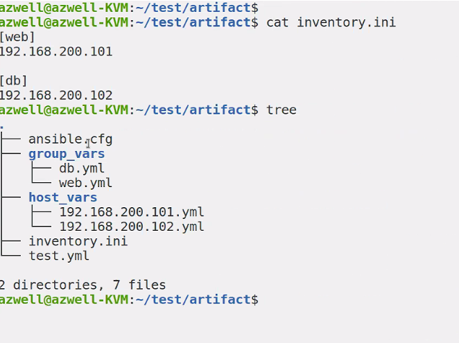
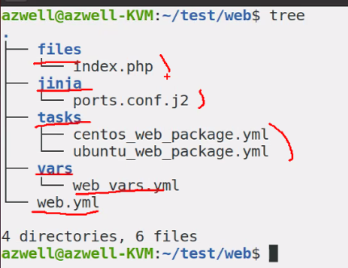

# 8. 아티팩트 재사용 - 파일
* Ansible에서 아티팩트란? 플레이북, 플레이, 테스크, 변수, 역할 같은 것들

하나의 큰 파일로 playbook을 작성할 수 있지만, 재사용성을 위해서 별도의 파일로 분리한다.

## 8.1 변수 재사용
### 1) 플레이북에서 변수 재사용
#### (1) var_files 키워드
vars 보다 vars_files가 우선순위가 높다.
```yaml
- hosts: all
  remote_user: root
  vars:
    favorcolor: blue
  vars_files: # 플레이의 속성
    - /vars/external_vars.yaml
  tasks:
    - name: This is just a Placeholder
      command: /bin/echo foo
```

#### (2) include_vars
```yaml
tasks:
  - name: Bare include(free-form) # default가 자유양식
    include_vars: myvars.yaml
```

```yaml
- name:
  include_vars:
    file: stuff.yaml
    name: stuff
```

include_vars 는 모듈이라서 task 안에 써야함


* 기존에 하던 실습의 변수를 vars_files로 설정

vars_files : 변수들을 모아 놓은 파일.<br/>
vars 를 사용하는것 보다 유용하게 사용할 수 있다.


```yaml
---
- name: Simple Web Deploy
  hosts: 192.168.200.101
  force_handlers: true
  vars_files:
  - vars/web_vars.yml

  tasks:
  - name: Install Pacakge for Ubuntu
    apt:
      name: apache2, libapache2-mod-php
      update_cache: true
      state: present
    when: ansible_distribution == "Ubuntu"
  
  - name: Install Package for CentOS
    yum:
      name: httpd, mod-php
      state: present
    when: ansible_distribution == "CentOS"

  - name: Copy PHP Contents
    copy:
      src: '{{ contents_file }}'
      dest: '/var/www/html/{{ contents_file }}'
      backup: true

  - name: Configure Apache Port
    template:
      src: ports.conf.j2
      dest: '/etc/apache2/ports.conf'
    notify:
    - Restart Service

  - name: Start Service
    service:
      name: apache2
      state: started
      enabled: true

  handlers:
  - name: Restart Service
    service:
      name: apache2
      state: restarted
      enabled: true
      
- hosts: 192.168.200.102
  vars_files:
    - vars/web_vars.yml
  tasks:
    - name: Checking
      uri:
        url: "http://192.168.200.101:{{ apache_port }}/{{ contents_file }}"
      ignore_errors: true

# 위의 플레이랑 동일 include vars 사용 vars_files가 선호됨
- hosts: 192.168.200.102
  tasks:
    - include_vars: # 모듈
      vars/web_vars.yml
    - name: Checking
      uri:
        url: "http://192.168.200.101:{{ apache_port }}/{{ contents_file }}"
      ignore_errors: true


```

* vars/web_vars.yml
```yaml
---
contents_file: index.php
apache_port: "8080"
```

### 2) 인벤토리/플레이북 디렉토리에서 변수 재사용

ini에다가
```ini
[그룹명:vars]
변수1=값
변수2=값
```
위처럼 해도 되지만, 그룹 변수, 호스트 변수를 더 잘 씀

#### (1) 그룹 변수 

같은 경로에 group_vars 폴더 내에 그룹과 동일한 이름의 yml 파일이 있으면 변수로 활용 가능
* 실습
ini
```yaml
[web]
192.168.200.101

[db]
192.168.200.102
```
cfg
```cfg
[defaults]
inventory=inventory.ini
```
```yaml
---
- hosts: all
  tasks:
  - debug:
      msg: "{{ msg }}"                       
```
```text
azwell@azwell-KVM:~/test/artifact$ tree
.
├── ansible.cfg
├── group_vars
│   ├── db.yml
│   └── web.yml
├── inventory.ini
└── test.yml

```

#### (2) 호스트 변수


Ansible 은 현재 디렉토리에 다음과 같은 디렉토리를 참고함<br/>
group_vars : 그룹 변수<br/>
host_vars : 호스트 변수

## 8.2 작업 재사용
섹션의 이름이 작업의 재사용이지만, 작업만 재사용할 수 있는 것은 아니다.

혼자서 개발할 때는 굳이 필요없는데 여러명이서 개발하고 통합할 때 좋음
* task.yaml
```yaml
- name: task1
  debug:
- name: task2
  debug:
```

* main.yaml
```yaml
- hosts: 192.168.200.101
  tasks:
    - import_tasks: task.yaml
    - name: task3
      debug:
    - name: task4
      debug:
```

include_tasks 모듈과 import_tasks 모듈 비교

`ansible-playbook <야뮬명> --list-tasks` 시 <br/> 
include_tasks는 동적, import_tasks는 정적으로 가져온다.<br/>
import의 경우 미리 사전에 playbook을 처리한다.

|          항목          |          include          |          import          |
|:----------------------:|:-------------------------:|:------------------------:|
|재사용형식|동적|정적|
|처리시점|모듈실행시|플레이북 파싱시 전처리|
|작업옵션|작업자체를포함하는 경우만|모든 가져오기 모듈에 적용가능|
|반복문에서 호출|사용가능|사용 불가|
|태그 및 작업 목록 확인|X|O|
|핸들러 알림|파일 내의 작업 이름 호출 X|파일 내의 작업 이름 호출 O|
|작업 시작|X|O
|플레이북 전체 가져오기|X|O|
|변수 파일 가져오기|O|X|


기본적으로 import를 사용하는 게..

* include, import 실습

multi vendor playbook을 만들 때 import 시키는 거 주로 함



```yaml
- name: Simple Web Deploy
  hosts: 192.168.200.101
  force_handlers: true
  vars_files:
  - vars/web_vars.yml

  tasks:
  - import_tasks: tasks/ubuntu_web_package.yml
    when: ansible_distribution == "Ubuntu"
  
  - import_tasks: tasks/centos_web_package.yml
    when: ansible_distribution == "CentOS"

  - name: Copy PHP Contents
    copy:
      src: 'files/{{ contents_file }}'
      dest: '/var/www/html/{{ contents_file }}'
      backup: true

  - name: Configure Apache Port
    template:
      src: jinja/ports.conf.j2
      dest: '/etc/apache2/ports.conf'
    notify:
    - Restart Service

  - name: Start Service
    service:
      name: apache2
      state: started
      enabled: true

  handlers:
  - name: Restart Service
    service:
      name: apache2
      state: restarted
      enabled: true

- hosts: 192.168.200.102
  gather_facts: no
  tasks:
  - name: Include variables
    include_vars: vars/web_vars.yml
  - name: Checking
    uri:
      url: "http://192.168.200.101:{{ apache_port }}/{{ contents_file }}"
    ignore_errors: true
```
