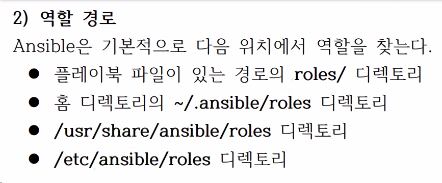

# 9. 아티팩트 재사용 - 역할

## 9.1 역할
### 1) 역할 디렉터리 구조

표준화된 디렉터리와 파일 구조


필요한 디렉토리와 파일만들면 된다.
디렉토리 구조 바뀌면 안된다. 인식 못함.

- tasks.main.yml : 작업정의
- handlers/main.yml :핸들러 정의
- tests/inventory : 역할 테스트용 디렉토리
- tests/test.yml : 역할 테스트용 플레이북
- defaults/main.yml : 기본 변수 정의 (매우 낮은 우선순위)
- vars/main.yml : 변수 정의 (상대적으로 높은 우선순위)

defaults 디렉토리 하위에는 거의 변하지 않는 기본 변수들을 저장함.

roles가 기본 디렉터리이다.
* 가장 중요한 것은 tasks
tasks 폴더 내의 main.yml, main.yaml, main 파일을 찾는다.<br/>
default와 vars에 모두 변수가 저장되는데 vars의 우선순위가 높다.
* files
  copy, file, patch 와 같은 파일 관련 디렉터리가 src/ 기본경로로 지정된다.
* templates
  templetes 기본 경로로 지정
* test 디렉터리는 사람들이 잘 안써..
 
tasks: handlrs 키워드를 해당 폴더 내에서는 지정하지 않는다.

* 역할 디렉터리 생성
`ansible-galaxy init`
* 


* 플레이에서 역할 사용
```yaml
- hosts: 
  roles:
  - common
  - webservers
```
roles 디렉토리 밑에 하위 디렉토리 들이 역할임.

* 작업을 실행하기 위해 pre_tasks, post_tasks 키워드도 있다.
- 작업순서
  1. pre_tasks 의 task
  2. pre_tasks 의 handler
  3. roles 의 task  & handler
  4. tasks 의 task
  5. post_tasks 의 task
  6. post_tasks 의 handler
  
새롭게 플레이를 실행하던 것을 post_tasks를 활용하여!
```yaml
- name: Simple Web Deploy
  hosts: 192.168.200.101
  force_handlers: true
  vars_files:
    - vars/web_vars.yml

  tasks:
    - name: Copy PHP Contents
      copy:
        src: 'files/{{ contents_file }}'
        dest: '/var/www/html/{{ contents_file }}'
        backup: true

    - name: Configure Apache Port
      template:
        src: jinja/ports.conf.j2
        dest: '/etc/apache2/ports.conf'
      notify:
        - Restart Service

    - name: Start Service
      service:
        name: apache2
        state: started
        enabled: true

  handlers:
    - name: Restart Service
      service:
        name: apache2
        state: restarted
        enabled: true

  post_tasks:
  - name: Checking
    uri:
      url: "http://192.168.200.101:{{ apache_port }}/{{ contents_file }}"
    ignore_errors: true
    delegate_to: 192.168.200.102
```

### 4) 역할 재사용
* 롤도 재사용가능
include_role, import_role

### 5) 역할 여러번 실행
같은 역할을 여러번 실행한다.

### 6) 역할 의존성
역할간의 의존성은 잘 정의를 하지 않음.

meta/main.yml 에 정의한다.

```yaml
dependencies:
  - role: common
    vars:
      some_parameters: 3
  - role: apache
    vars:
      apache_port: 80
  - role: postgres
    vars:
       dbname: blarg
       other_parameter: 12
```

* [https://github.com/ansible/ansible-examples](https://github.com/ansible/ansible-examples)

* 실습
  뼈대를 만들자!
```shell
$ ansible-galaxy init roles/apache
- Role roles/apache was created successfully
```

필요한 파일들만 남기고 지우자
```shell
$ tree
.
├── roles
│   └── apache
│       ├── files
│       │   └── index.php
│       ├── handlers
│       │   └── main.yml
│       ├── tasks
│       │   ├── centos_web_package.yml
│       │   ├── main.yml
│       │   └── ubuntu_web_package.yml
│       ├── templates
│       │   └── ports.conf.j2
│       └── vars
│           └── main.yml
└── web.yml
```

* roles/apache/files/index.php
```php
<?php
phpinfo();
?>
```
* roles/apache/handlers/main.yml
```yaml
---
- name: Restart Service
  service:
    name: apache2
    state: restarted
    enabled: true
```
* roles/apache/tasks/centos_web_package.yml
```yaml
  - name: Install Package for CentOS
    yum:
      name: httpd, mod-php
      state: present
    when: ansible_distribution == "CentOS"
```
* roles/apache/tasks/ubuntu_web_package.yml
```yaml
  - name: Install Pacakge for Ubuntu
    apt:
      name: apache2, libapache2-mod-php
      update_cache: true
      state: present
    when: ansible_distribution == "Ubuntu"
```
* roles/apache/tasks/main.yml
```yaml
---
  - import_tasks: ubuntu_web_package.yml
    when: ansible_distribution == "Ubuntu"
  
  - import_tasks: centos_web_package.yml
    when: ansible_distribution == "CentOS"

  - name: Copy PHP Contents
    copy:
      src: '{{ contents_file }}'
      dest: '/var/www/html/{{ contents_file }}'
      backup: true

  - name: Configure Apache Port
    template:
      src: ports.conf.j2
      dest: '/etc/apache2/ports.conf'
    notify:
    - Restart Service

  - name: Start Service
    service:
      name: apache2
      state: started
      enabled: true
```
* roles/apache/templates/ports.conf.j2
```conf
Listen {{ apache_port }}

<IfModule ssl_module>
	Listen 443
</IfModule>

<IfModule mod_gnutls.c>
	Listen 443
</IfModule>
```
* roles/apache/vars/main.yml
```yaml
---
contents_file: index.php
apache_port: "8080"
```
web.yml
```yaml
- name: Simple Web Deploy
  hosts: 192.168.200.101
  force_handlers: true

  roles:
    - apache

  post_tasks:
    - include_vars: roles/apache/vars/main.yml
    - name: Checking
      uri:
        url: "http://192.168.200.101:{{ apache_port }}/{{ contents_file }}"
      ignore_errors: true
      delegate_to: 192.168.200.102
```

## 9.2 Ansible Galaxy
역할을 만들어서 공유가 가능<br/>

### 1) Ansible 컨텐츠
* 역할

* 컬랙션
Ansible 2.8 부터 추가된 새로운 패키징 형식<br/>
플레이북, 역할, 모듈, 플러그인을 하나의 아티팩트로 패키징함

* 플레이북 번들(APB: Ansible Playbook Bundle)
플레이북, 메타데이터 파일로 구성된 경량 애플리케이션 번들로<br/>
OpenShift Origin 클러스터에 애플리케이션을 배포하기 위한 번들

### 2) ansible-galaxy 명령
#### (1) 역할 찾기
`ansible-galaxy search <SEARCH>`

* elasticsearch 키워드 및 geerlingguy 사용자 검색
`ansible-galaxy search elasticsearch --author geerlingguy`


#### (2) 역할 정보 확인
```shell
ansible-galaxy info <역할명>
```

#### (3) 역할 설치
```shell
ansible-galaxy install --roles-path . <역할명>
```

#### (4) 특정 버전 역할 설치
```shell
ansible-galaxy install <역할명,버전>
```
--roles-path 지정하지 않으면 ~/.ansible/roles 에 설치됨
